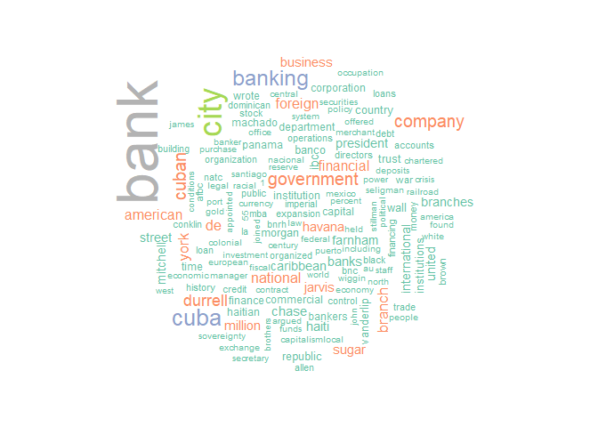
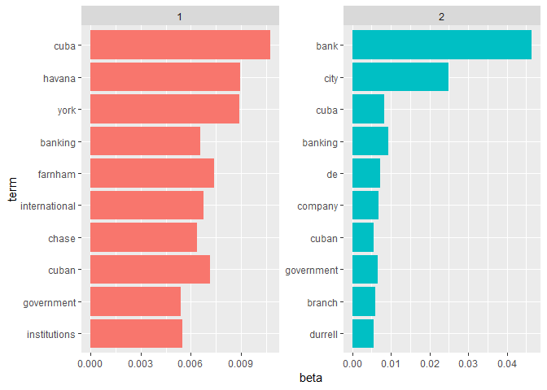
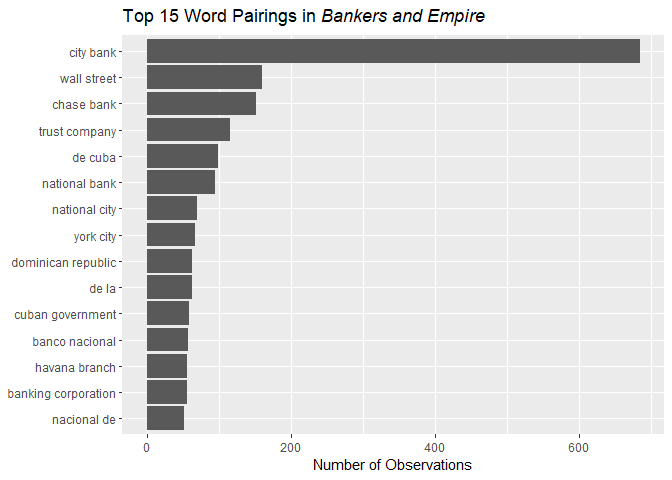
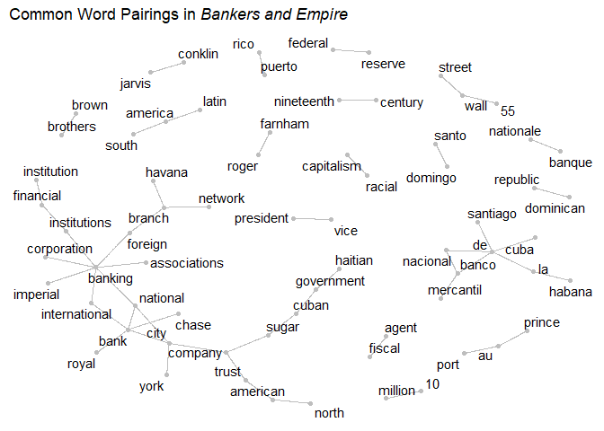

*Bankers and Empire* Text Analysis
================

## Loading and Cleaning

``` r
#load lines of book from text file
book_text = here("bankers_and_empire.txt") %>% 
  read_file() %>%
  tibble(txt = .) %>%
  unnest_tokens(line, txt, token = "lines")

# load sentences of book from text file
book_sentences =  here("bankers_and_empire.txt") %>% 
  read_file() %>%
  tibble(txt = .) %>% 
  unnest_tokens(sentence, txt, token = "sentences")

#remove captions
temp = tibble(sentence = character())
for (line_index in 1:length(book_sentences[[1]])) {
  if (!(str_length(book_sentences[line_index,]) < 50)) {
    temp = bind_rows(temp, book_sentences[line_index,])
  }
}

book_sentences = temp

#remove page numbers
temp = tibble(line = character())
for (line_index in 1:length(book_text[[1]])) {
  if (!str_detect(book_text[line_index,], "/") && !(str_length(book_text[line_index,]) < 50)) {
    temp = bind_rows(temp, book_text[line_index,])
  }
}

book_words = temp %>% unnest_tokens(word, line, token = "words")
rm(temp, book_text)

#remove possessive "'s" from words
for (line_index in 1:length(book_words[[1]])) {
  if (str_detect(book_words[line_index,], "’s") || str_detect(book_words[line_index,], "'s")) {
    book_words[line_index,] = str_sub(book_words[line_index,], 
                                     start = 1, end = (str_length(book_words[line_index,]) - 2))
  }
}
```

## Wordcloud

``` r
book_words %>%
  anti_join(stop_words) %>%
  count(word) %>%
  with(wordcloud(word, n, max.words = 150, colors = brewer.pal(8, "Set2")))
```

<!-- -->

## Topic Modeling

``` r
book_words_cleaned = book_words %>%  anti_join(stop_words)
model = tibble(document = 1, term = count(book_words_cleaned, word)[[1]], count = count(book_words_cleaned, word)[[2]]) %>% 
  cast_dtm(document, term, count) %>% 
  LDA(2, control = list(seed = 60615))

topics <- tidy(model, matrix = "beta")

top_terms <- topics %>%
  group_by(topic) %>%
  top_n(10, beta) %>%
  ungroup() %>%
  arrange(topic, -beta)

top_terms %>%
  mutate(term = reorder(term, beta)) %>%
  ggplot(aes(term, beta, fill = factor(topic))) +
  geom_col(show.legend = FALSE) +
  facet_wrap(~ topic, scales = "free") +
  coord_flip()
```

<!-- -->

``` r
ggsave(here("Charts", "topic_model.pdf"), device = "pdf")
```

There doesn’t seem to be enough heterogenity in the text for an LDA
model to pick out different topics.

## Flesch-Kincaid Grade Level

The Flesch-Kincaid grade level is determined by the function


``` r
n_words = length(book_words[[1]])
n_sent = length(book_sentences[[1]])
#warning: this will take a surprisingly long amount of time, even parallelized
n_syll = parSapply(cl, book_words$word, english_syllable_count) %>% sum()
f_k_score = 0.39 * (n_words / n_sent) + 11.8 * (n_syll / n_words) - 15.59
```

*Bankers and Empire* has a Flesch-Kincaid score of a 17<sup>th</sup>
grade reading level.

## N-Gram

``` r
book_n_grams = nest(book_words) %>% 
  mutate(text = map(data, unlist), 
         text = map_chr(text, paste, collapse = " ")) %>%
  select(text) %>% unnest_tokens(bigram, text, token = "ngrams", n = 2)

# #filter out stop (uninteresting) words
# cont_stop = function(x) {
#   return(x %in% tidytext::stop_words)
# }

book_n_grams = separate(book_n_grams, bigram, c("word1", "word2"), sep = " ")

# # Calculate the number of cores
# no_cores <- detectCores() - 1
#  
# # Initiate cluster
# cl <- makeCluster(no_cores)

book_n_grams$has_stop_one = book_n_grams$word1 %in% stop_words$word
book_n_grams$has_stop_two = book_n_grams$word2 %in% stop_words$word
  
bigrams = book_n_grams %>%
  filter(has_stop_one == FALSE) %>%
  filter(has_stop_two == FALSE) %>%
  unite(bigram, "word1", "word2", sep = " ")

bigram_count = count(bigrams, bigram, sort = TRUE)
bigram_count$n = as.numeric(bigram_count$n)

ggplot(data = filter(bigram_count, n > 48), aes(y = n, x = reorder(bigram, n))) + 
  geom_col() + 
  coord_flip() +
  labs(title = expression(paste("Top 15 Word Pairings in ", italic("Bankers and Empire"))), x = NULL, y = "Number of Observations")
```

<!-- -->

``` r
ggsave(here("Charts", "word_pairings.pdf"), device = "pdf")

bigram_count = separate(bigram_count, bigram, c("word1", "word2"), sep = " ")

bigram_graph <- bigram_count %>%
  filter(n > 20) %>%
  graph_from_data_frame()

remove_axes <- theme(
  axis.text = element_blank(),
  axis.line = element_blank(),
  axis.ticks = element_blank(),
  panel.border = element_blank(),
  panel.grid = element_blank(),
  axis.title = element_blank()
)

ggraph(bigram_graph, layout = "fr") +
  geom_edge_link(color = "grey") +
  geom_node_point(color = "grey") +
  geom_node_text(aes(label = name), nudge_x = 0, nudge_y = 0, repel = TRUE) +
  labs(title = expression(paste("Common Word Pairings in ", italic("Bankers and Empire")))) +
  theme_light() +
  remove_axes
```

<!-- -->

``` r
ggsave(here("Charts", "word_pair_graph.pdf"), device = "pdf")
```
